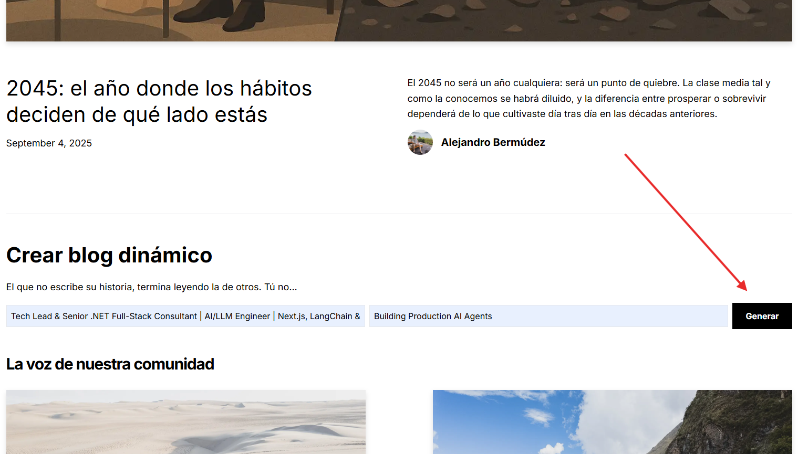
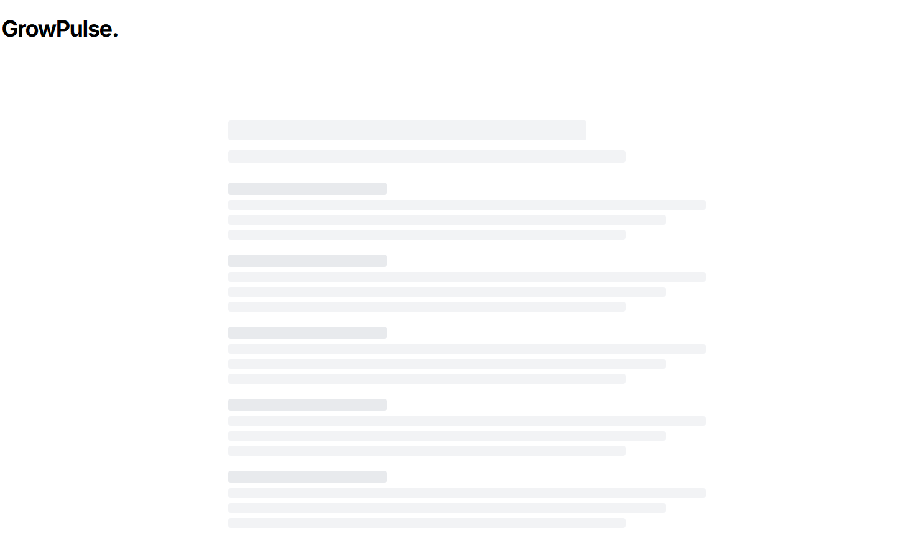
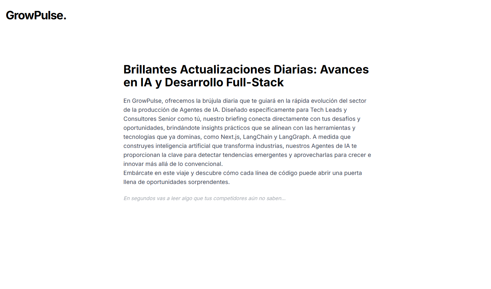
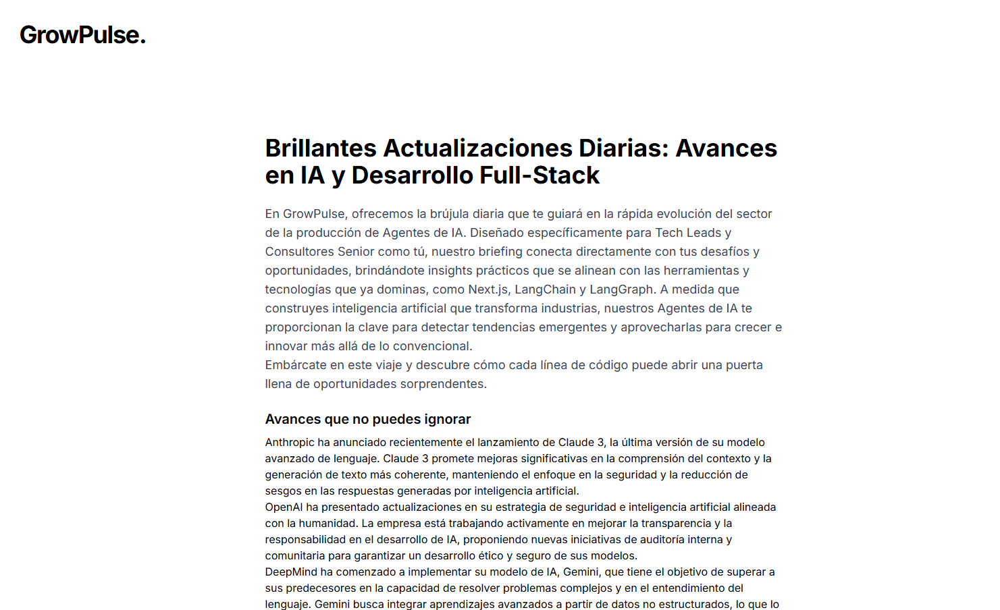

# 🌿 GrowRoutine Frontend

⚠️ **Status:** Active development.  
The main intelligence and orchestration live in the **[GrowPulse Backend](https://github.com/mejorandro/growpulse-backend)**.  

---

## 🚧 About This Repo
The **GrowRoutine Frontend** is a **Next.js 14/15** app designed to transform backend outputs into a **dynamic blog-like experience**.  

It currently supports:
- Static Markdown posts (`/posts`)  
- Author metadata and image handling  
- Blog previews and Hero sections  
- A working **form component (StartBlogForm)** connected to the backend API  

At this stage:
- ✅ Blog engine is running with static content  
- ✅ Frontend successfully connects to backend API  
- ✅ First AI-generated briefings are rendered from `profession + sector` input  

---

## 🌱 What is GrowRoutine?
GrowRoutine is the overarching initiative — a long-term vision built on **pillars of growth, technology, and discipline**.  
It serves as the foundation for projects like GrowPulse, ensuring that every new development aligns with a philosophy of sustainable improvement.  

---

## 🔗 The Role of GrowPulse
**GrowPulse** is the first practical application built under GrowRoutine.  
It acts as an **AI-driven interpreter of daily information**, transforming scattered news and insights into clear opportunities, actions, and experiments.  

The backend provides:
- AI agent orchestration (**LangChain + LangGraph**)  
- Daily readings pipeline (news → meaning → actions → posts → POC ideas)  
- JSON API consumable by this frontend  
- FastAPI + Uvicorn deployment  

---

## 🌟 Continuous Evolution
GrowRoutine is not static — it is designed to **continuously refine outputs**.  
As more pillars are added, the system will:  
- Introduce new AI-driven modules.  
- Improve how insights are structured and delivered.  
- Expand the range of use cases beyond blogs into tools for decision-making, creativity, and professional leverage.  

---

## ✨ Current Features
- **Static blogs** powered by Markdown under `/posts`  
- **Dynamic form (StartBlogForm)** → sends profession + sector → returns a generated blog  
- Rendering of AI-generated sections:  
  - Title & summary  
  - News  
  - Meaning (opportunities)  
  - Action  
  - LinkedIn post  
  - POC ideas  
  - Compounding  
  - Final summary  

---

## 🚀 Next Features (Roadmap)
We are evolving from a **static reader** into a **dynamic funnel for knowledge and action**:  

- **Prompt refinement** → richer, sharper insights delivered in every output  
- **Progressive rendering** → titles and summaries appear instantly, while deeper layers unfold step by step (ChatGPT-style)  
- **Analytics** → visibility into engagement and drop-off, so we learn what truly resonates  
- **Authentication** → secure publishing, tailored to each user (Google Auth, Cognito)  
- **SEO** → indexable `/profession/sector` pages that give every generated blog its own presence  

---

## 💡 Future & Disruptive Ideas
This project is built on pillars designed to grow and adapt. Beyond the roadmap, here are directions where contributors could help shape the future:  

- **Interactive Companions** → turn blogs into conversational agents that answer follow-up questions or suggest next steps.  
- **Knowledge Graphs** → connect insights across posts, professions, and sectors, showing hidden patterns and trends.  
- **Community Layer** → let users contribute reflections, comments, or their own “1% improvements” tied to each blog.  
- **Voice & Multimodal Output** → generate not just text but audio briefings, short video explainers, or carousel-ready visuals.  
- **Personalized Dashboards** → track learning, actions taken, and growth over time — turning reading into measurable progress.  
- **AI Marketplace of Pillars** → plug in new specialized agents (finance, health, productivity, leadership) that extend the ecosystem.  

🌱 **An open canvas**: The pillars here are just the start. If you see a disruptive idea — no matter how bold — share it. The best future features are often born from outside perspectives.  

---

## 🖼️ Planned Architecture
Even though still evolving, the architecture looks like this:  


---

## 📝 Blog Creation Flow

The current blog creation flow works as follows:

1. User enters **profession + sector** in the form.  
2. API call to backend generates blog title + summary.  
3. Progressive rendering shows blog sections step by step.  

# App Screenshots 

## Form
  

## Loading Page
  

## Generated AI Blog Content
  

## Final blog
  

---

## ⚡ Quick Start

```bash
git clone https://github.com/mejorandro/growpulse-frontend
cd growpulse-frontend
npm install
npm run dev
```

> Requires **Node.js >=18.17** and npm/yarn/pnpm.

---

## 🔑 Environment Variables

Create a `.env.local` file in the root with:

```
NEXT_PUBLIC_APP_URL=http://localhost:3000
NEXT_PUBLIC_BACKEND_URL=http://localhost:8000
```

An `.env.example` is included for collaborators.

---

## 📂 Project Structure

```
/app
  /_components   → UI reusable components
  /posts         → Markdown blogs
  /api           → Routes
/public          → Images, assets
/docs            → Diagrams & architecture
```

---

## 🤝 Contributing

- Follow **Conventional Commits** (`feat:`, `fix:`, `docs:`, `chore:`).  
- Pull requests should include description + screenshots if UI changes.  
- Use ESLint + Prettier for consistency.  
- Add tests for new features.

---

## 🚀 Deployment

### Default
- Recommended: **Vercel** (ideal for Next.js apps).  
- Ensure env vars are set in Vercel dashboard.  
- Auto-deploys from `main` branch.  

### Custom Production Deployment (Current)
The project is also deployed on **AWS EC2 (Ubuntu 22.04 LTS)** following a production-ready process.

**Tech Used**
- AWS EC2 (Ubuntu 22.04 LTS)  
- Node.js 20 (LTS)  
- Next.js 15  
- Nginx (reverse proxy, SSL termination)  
- Let’s Encrypt (Certbot)  
- systemd  
- Git  

**Server Structure**
```
/srv/<project>/frontend      Application source
/etc/<project>/frontend.env  Environment variables
/var/log/<project>/frontend  Logs
```

**Deployment Steps**
1. Provisioned EC2 instance and configured security groups (SSH, HTTP, HTTPS).  
2. Installed Git, Node.js, Nginx, and Certbot.  
3. Cloned repository and built frontend with `npm ci && npm run build`.  
4. Added systemd service to manage Next.js lifecycle on port 3000.  
5. Configured Nginx to redirect HTTP→HTTPS and proxy traffic to Next.js.  
6. Issued TLS certificates with Certbot and tested auto-renewal.  

**Security**
- HTTPS enforced.  
- Security headers applied via Nginx.  
- Access controlled by AWS Security Group.  

**Result**
- Frontend successfully deployed with HTTPS.  
- Available at **https://growroutine.com** (currently private, expected public release in early October).  

---

## 📜 License

This project is under the **MIT License**. See `LICENSE` file for details.

---

## 📌 Note for Visitors
If you’re evaluating this project (e.g., as a hiring manager or collaborator):  
- The backend is where the **AI engine** lives.  
- This frontend is actively evolving into a **funnel-based, role-aware blog generator**.  
- Long-term goal: a **personalized daily AI briefing** platform that helps professionals stay updated and showcase their expertise.  

🌱 GrowPulse (subproject of **GrowRoutine**) is not just about blogs — it’s about **scalable growth**: turning consistent daily improvements into global opportunities.  
