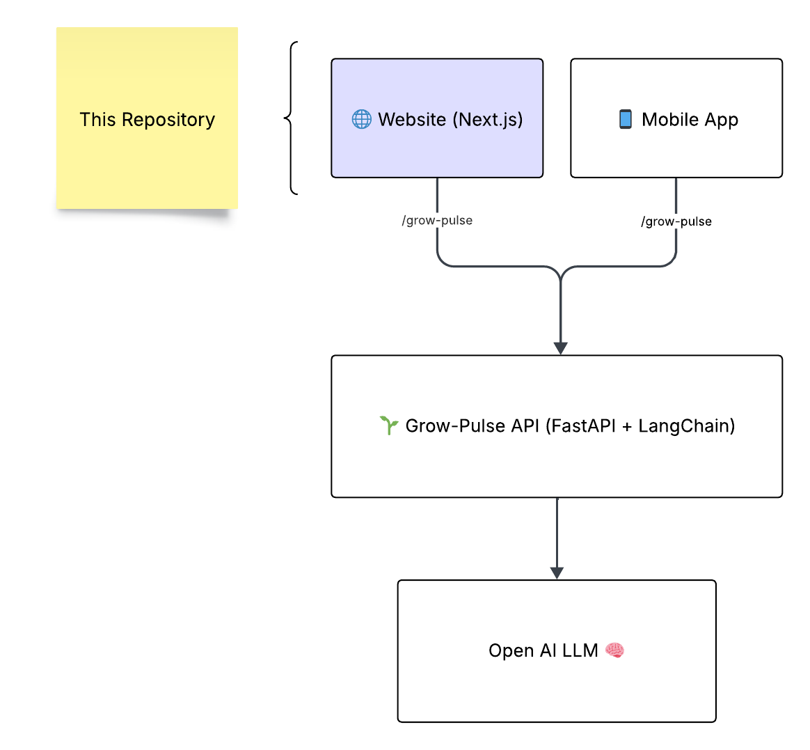

# 🌿 GrowPulse Frontend

⚠️ **Status:** Active development.  
The main intelligence and orchestration live in the **[GrowPulse Backend](https://github.com/mejorandro/growpulse-backend)**.  

---

## 🚧 About This Repo
The **GrowPulse Frontend** is a **Next.js 14** app designed to transform backend outputs into a **dynamic blog-like experience**.  

It currently supports:
- Static Markdown posts (`/posts`)  
- Author metadata and image handling  
- Blog previews and Hero sections  
- A working **form component (StartBlogForm)** connected to the backend API  

At this stage:
- ✅ Blog engine is running with static content  
- ✅ Frontend successfully connects to backend API  
- ✅ First AI-generated briefings are rendered from `profession + sector` input  

---

## 🔗 Where to Look First
👉 Please visit the backend repository to see the **real intelligence engine**:  

**➡️ [GrowPulse Backend](https://github.com/mejorandro/growpulse-backend)**  

The backend provides:
- AI agent orchestration (**LangChain + LangGraph**)  
- Daily readings pipeline (news → meaning → actions → posts → POC ideas)  
- JSON API consumable by this frontend  
- FastAPI + Uvicorn deployment  

---

## ✨ Current Features
- **Static blogs** powered by Markdown under `/posts`  
- **Dynamic form (StartBlogForm)** → sends profession + sector → returns a generated blog  
- Rendering of AI-generated sections:  
  - Title & summary  
  - News  
  - Meaning (opportunities)  
  - Action  
  - LinkedIn post  
  - POC ideas  
  - Compounding  
  - Final summary  

---

## 🚀 Next Features (Roadmap)
We are evolving from a **static reader** to a **dynamic funnel**:  
- **Redirect Flow:** instead of showing full blog inline, redirect users to `/{profession}/{sector}`  
- **Progressive Rendering:** show title + summary instantly, reveal sections step by step (ChatGPT-style)  
- **Analytics:** track funnel drop-off and engagement  
- **Authentication:** allow publishing only for logged-in users (Google Auth, Cognito)  
- **SEO:** make each `/profession/sector` page indexable with dynamic metadata  

---

## 🖼️ Planned Architecture
Even though still evolving, the architecture looks like this:  



---

## ⚡ Quick Start

```bash
git clone https://github.com/mejorandro/growpulse-frontend
cd growpulse-frontend
npm install
npm run dev
```

> Requires **Node.js >=18.17** and npm/yarn/pnpm.

---

## 🔑 Environment Variables

Create a `.env.local` file in the root with:

```
NEXT_PUBLIC_APP_URL=http://localhost:3000
NEXT_PUBLIC_BACKEND_URL=http://localhost:8000
```

An `.env.example` is recommended for collaborators.

---

## 📂 Project Structure

```
/app
  /_components   → UI reusable components
  /posts         → Markdown blogs
  /api           → Routes
/public          → Images, assets
/docs            → Diagrams & architecture
```

---

## 🤝 Contributing

- Follow **Conventional Commits** (`feat:`, `fix:`, `docs:`, `chore:`).  
- Pull requests should include description + screenshots if UI changes.  
- Use ESLint + Prettier for consistency.  
- Add tests for new features.

---

## 🧪 Testing

We aim to cover:  
- **Unit tests** for components (Jest, React Testing Library)  
- **Integration tests** for API routes  
- **E2E tests** with Playwright or Cypress  

Run tests with:

```bash
npm run test
```

---

## 🚀 Deployment

- Default deployment target: **Vercel** (recommended for Next.js)  
- Ensure env vars are set in Vercel dashboard  
- Auto deploys from `main` branch

---

## 📜 License

This project is under the **MIT License**. See `LICENSE` file for details.

---

## 📌 Note for Visitors
If you’re evaluating this project (e.g., as a hiring manager or collaborator):  
- The backend is where the **AI engine** lives.  
- This frontend is actively evolving into a **funnel-based, role-aware blog generator**.  
- Long-term goal: a **personalized daily AI briefing** platform that helps professionals stay updated and showcase their expertise.  

🌱 GrowPulse (subproduct of **GrowRoutine**) is not just about blogs — it’s about **scalable personal growth**: turning 1% daily improvements into global opportunities.  
