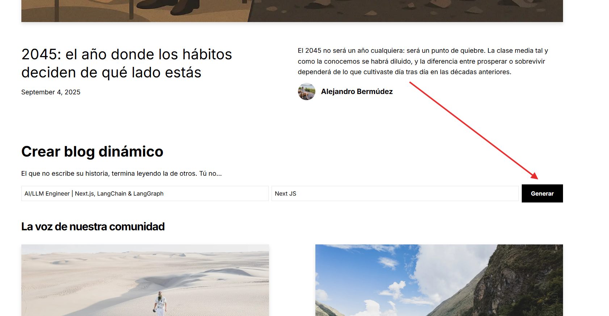
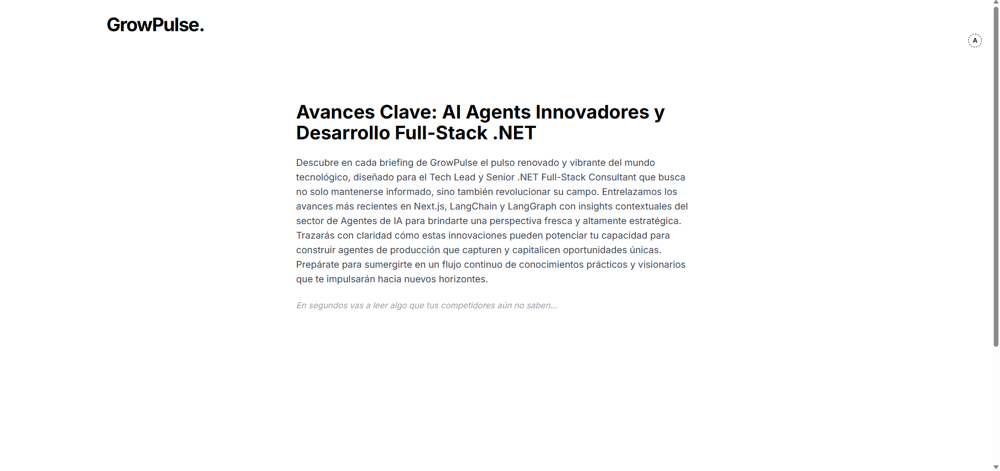

# 🌿 GrowPulse Frontend

⚠️ **Status:** Active development.  
The main intelligence and orchestration live in the **[GrowPulse Backend](https://github.com/mejorandro/growpulse-backend)**.  

---

## 🚧 About This Repo
The **GrowPulse Frontend** is a **Next.js 14** app designed to transform backend outputs into a **dynamic blog-like experience**.  

It currently supports:
- Static Markdown posts (`/posts`)  
- Author metadata and image handling  
- Blog previews and Hero sections  
- A working **form component (StartBlogForm)** connected to the backend API  

At this stage:
- ✅ Blog engine is running with static content  
- ✅ Frontend successfully connects to backend API  
- ✅ First AI-generated briefings are rendered from `profession + sector` input  

---

## 🔗 Where to Look First
👉 Please visit the backend repository to see the **real intelligence engine**:  

**➡️ [GrowPulse Backend](https://github.com/mejorandro/growpulse-backend)**  

The backend provides:
- AI agent orchestration (**LangChain + LangGraph**)  
- Daily readings pipeline (news → meaning → actions → posts → POC ideas)  
- JSON API consumable by this frontend  
- FastAPI + Uvicorn deployment  

---

## ✨ Current Features
- **Static blogs** powered by Markdown under `/posts`  
- **Dynamic form (StartBlogForm)** → sends profession + sector → returns a generated blog  
- Rendering of AI-generated sections:  
  - Title & summary  
  - News  
  - Meaning (opportunities)  
  - Action  
  - LinkedIn post  
  - POC ideas  
  - Compounding  
  - Final summary  

---

## 🚀 Next Features (Roadmap)
We are evolving from a **static reader** to a **dynamic funnel**:  
- **Redirect Flow:** instead of showing full blog inline, redirect users to `/{profession}/{sector}`  
- **Progressive Rendering:** show title + summary instantly, reveal sections step by step (ChatGPT-style)  
- **Analytics:** track funnel drop-off and engagement  
- **Authentication:** allow publishing only for logged-in users (Google Auth, Cognito)  
- **SEO:** make each `/profession/sector` page indexable with dynamic metadata  

---

## 🖼️ Planned Architecture
Even though still evolving, the architecture looks like this:  


---

## 📝 Blog Creation Flow

The current blog creation flow works as follows:

1. User enters **profession + sector** in the form.  
2. API call to backend generates blog title + summary.  
3. Progressive rendering shows blog sections step by step.  

### Screenshots

  
  
  

---

## ⚡ Quick Start

```bash
git clone https://github.com/mejorandro/growpulse-frontend
cd growpulse-frontend
npm install
npm run dev
```

> Requires **Node.js >=18.17** and npm/yarn/pnpm.

---

## 📌 Note for Visitors
If you’re evaluating this project (e.g., as a hiring manager or collaborator):  
- The backend is where the **AI engine** lives.  
- This frontend is actively evolving into a **funnel-based, role-aware blog generator**.  
- Long-term goal: a **personalized daily AI briefing** platform that helps professionals stay updated and showcase their expertise.  

🌱 GrowPulse (subproduct of **GrowRoutine**) is not just about blogs — it’s about **scalable personal growth**: turning 1% daily improvements into global opportunities.  
